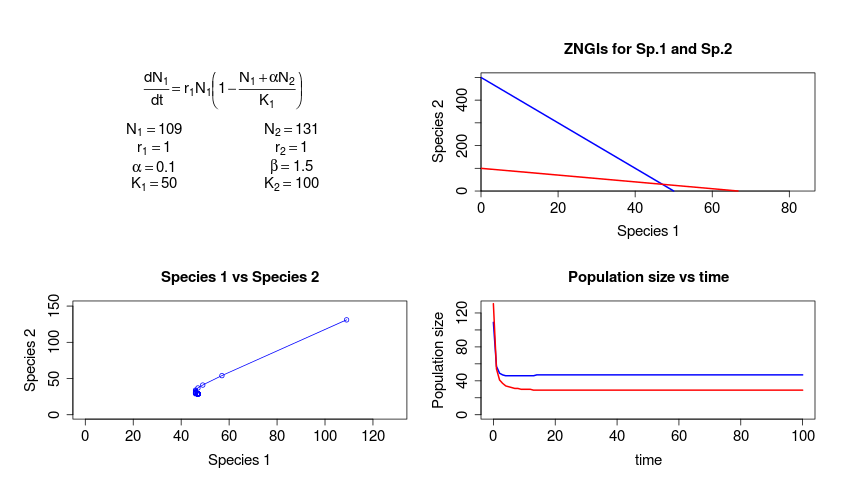
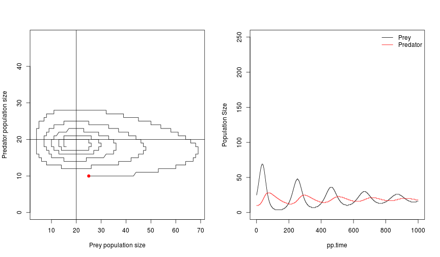

<!-- Center image on slide -->
<script src="http://ajax.aspnetcdn.com/ajax/jQuery/jquery-1.7.min.js"></script>
<script type='text/javascript'>
$(function() {
    $("p:has(img)").addClass('centered');
});
</script>

<style>
strong {
  font-weight: bold;
}
</style>

<style>
em {
  font-style: italic
}
</style>

--- .class #id bg:#404040

<br><br><br><br><br><br>
<center> <font color="white" size=30> Ecology is ripe with <font color=#FF6161 size = 45> models </font> </font> </center>

--- bg:#404040

> From the simple...
<br>
> $$ \frac{dN}{dt} = (rN) $$
> $$ \frac{dI}{dt} = \frac{\alpha+d+\nu}{\beta} $$
<br>

--- bg:#404040

> From the simple...
<br>
> $$ \frac{dN}{dt} = (rN) $$
> $$ \frac{dI}{dt} = \frac{\alpha+d+\nu}{\beta} $$
<br
> To the slightly more complicated
> $$ \frac{dN_{i}}{dt} = (rN)\left(1-\frac{N_{i} +  \sum\limits_{j=1}^j \alpha_{j,i}*N_{j}}{K_{1}}\right) $$

--- bg:#404040

> To the even more complicated

$$ \lambda_{\bar{i}} (D - x) = (1 - m) \left( \frac{J-N_{i}-X}{J-D} \right) $$
 
<br>

$$ Pr\{N_{i},N_{j},N_{k}, \ldots , N_{s} | N_{i},N_{j},N_{k}, \ldots , N_{s} \} = $$ $$ \sum\limits_{i=1}^s \frac{N_{i}}{J} \left[ mP_{i} + (1-m) \left( \frac{N_{i}-1}{J-1} \right) \right] $$


--- .class #id bg:#404040

<br><br><br><br><br><br>
<center> <font color="white" size=30> How can we leverage `R` as a <font color=#FF6161 size=45> pedagogical </font> tool? </font> </center>

--- .class #id bg:#404040

> - Consider two groups of grad students: <font color = #FF6161> red </font> and <font color = #FFF390> yellow </font>.
> - There is a limited supply of coffee in the department, for which the two groups compete. 

> - 
<br>

--- .class #id bg:#404040


<br>

> - Grad students' coffee consumption is decreased by others in the same group (***intraspecific*** competition) and grad students in other groups (***interspecific*** competition)
> - $\alpha$ = estimate of interspecific competition

--- .class #id bg:#404040
## Lotka-Volterra equations model these systems.

> - Consider a two-species system. 
> - $N_{1}$ and $N_{2}$ represent population sizes of the two groups
> - L-V competition equations allow us to project changes in $N$ over time
<br>
> - $$ \frac{dN_{1}}{dt} = (rN)\left(1-\frac{N_{1} + \alpha_{2,1}*N_{2}}{K_{1}}\right) $$
> - $$ \frac{dN_{2}}{dt} = (rN)\left(1-\frac{N_{2} + \alpha_{1,2}*N_{1}}{K_{2}}\right) $$
<align = "center">
> - This is a pair of <font size= 30 color = #FF6161> ***Ordinary Differential Equations*** (ODEs) </font> 
</align>

--- .class #id bg:#404040
## ODEs track the <font color = #FF6161> change </font> in variables of interest

$$ \frac{dN}{dt} = (rN)\left(1-\frac{N + \alpha*N_{1}}{K_{2}}\right) $$

> - The rate of change of `N` is a function of the value of `N` at the previous time step (`t-1`) and the system's parameters (e.g. r, $\alpha$)

--- .class #id bg:#404040
## Dynamic models require dynamic solutions

> - $$ \frac{dN_{1}}{dt} = (rN)\left(1-\frac{N_{1} + \alpha_{2,1}*N_{2}}{K_{1}}\right) $$

> - The equilibrium value of $N_{1}$ is a function of $\alpha$ and $N_{2}$:

> - $$ \hat{N_{1}} = K + \alpha * N_{2} $$

> - Base `R` lacks an ODE solver, but `deSolve` comes to the rescue.

--- bg:#404040

## Introducing `deSolve`


```r
# install.packages("deSolve")
require("deSolve")
ls("package:deSolve")
```

```
##  [1] "aquaphy"             "ccl4data"            "ccl4model"          
##  [4] "cleanEventTimes"     "daspk"               "dede"               
##  [7] "diagnostics"         "diagnostics.default" "diagnostics.deSolve"
## [10] "DLLfunc"             "DLLres"              "euler"              
## [13] "euler.1D"            "lagderiv"            "lagvalue"           
## [16] "lsoda"               "lsodar"              "lsode"              
## [19] "lsodes"              "matplot.1D"          "nearestEvent"       
## [22] "ode"                 "ode.1D"              "ode.2D"             
## [25] "ode.3D"              "ode.band"            "plot.1D"            
## [28] "radau"               "rk"                  "rk4"                
## [31] "rkMethod"            "SCOC"                "timestep"           
## [34] "vode"                "zvode"
```

--- bg:#404040
## Introducing the function `ode`

```r
str(ode)
```

```
## function (y, times, func, parms, method = c("lsoda", "lsode", "lsodes", 
##     "lsodar", "vode", "daspk", "euler", "rk4", "ode23", "ode45", "radau", 
##     "bdf", "bdf_d", "adams", "impAdams", "impAdams_d", "iteration"), 
##     ...)
```

--- bg:#404040
## How to use `ode`

```r
str(ode)
```

```
## function (y, times, func, parms, method = c("lsoda", "lsode", "lsodes", 
##     "lsodar", "vode", "daspk", "euler", "rk4", "ode23", "ode45", "radau", 
##     "bdf", "bdf_d", "adams", "impAdams", "impAdams_d", "iteration"), 
##     ...)
```

> - `y` = initial values of the system (here, $N_{1}$ and $N_{2}$)  
> - `times` = length of time steps we want to project  
> - `func` = a user-defined function to solve (here, the L-V equations!)  
> - `parms` = the parameters to be used in `func` (here, $\alpha$, $K_{1}$, etc.)  

--- bg:#404040
## Setting up the user-defined `func`


```r
# Define the function lv
lv <- function (time , init , params) {
  
  # set everything up as a list to be accessed throughout the function
  with (as.list(c(time , init , params)), {

    # description of parameters to be included in params:
    # r1 = growth rate of Sp. 1; r2 = growth rate of Sp. 2
    # N = population size of Sp. 1; P = Population Size Sp. 2
    # a = competitive impact of Sp. 2 on Sp. 1; b = competitive impact of Sp 1 on Sp 2
    # K1 and K2 = carrying capacities of Sp. 1 and Sp. 2, respectively
    
    # Define the pair of ODEs:
    
    # Growth of species 1 is a function of species 2
    N1 <- ( r1 * N * (1 - (N+a*P) / K1) )
    # Growth of species 2 is a function of species 1
    N2 <- ( r2 * P * (1 - (P+b*N) / K2) )
    
    # Return a list of the current population size of Sp.1  and Sp. 2
    return (list (c (N1 , N2)))
  })
}
```

--- bg:#404040

## Testing `lv`

Provide a set of starting parameters:


```r
# randomly select values for starting N1 and N2
p <- runif(n = 2, min = 50, max = 150)
init<-c(N = floor(p[1]), P = floor (p[2])) 

# run the ODE for 100 time steps
time  <- seq (0, 100, by=1)
# define species growth rates, carrying capacities and interspecific competition parameters
params <- c(r1 = 1, b = 1.5 , K1 = 50 , r2 = 1, a = .1 , K2 = 100)

# run the ODE 
lvout <- floor(as.data.frame(ode(func=lv,y=init,parms=params,times=time)))

str(lvout)
```

--- bg:#404040

## Testing `lv`

```
## 'data.frame':	101 obs. of  3 variables:
##  $ time: num  0 1 2 3 4 5 6 7 8 9 ...
##  $ N   : num  56 46 45 45 45 45 46 46 46 46 ...
##  $ P   : num  132 68 51 44 40 37 35 33 32 32 ...
```

<align = "center">
> - <font color = #FF6161 size="65"> It works! </font>

</align>

--- bg:#404040

## Fun with graphs


```r
par(mfrow=c(2,2),bg="white")

# Plot equation and parameters

# Panel A: current parameter values
plot(1:10,type="n",xlab="",ylab="",xaxt="n",yaxt="n",bty="n")
text(5,9,expression(frac(dN[1],dt) == r[1]*N[1]*bgroup("(",1-frac(N[1]+alpha*N[2],K[1]),")")),cex=1.5)
text(3,5.7,bquote(N[1] == .(floor(p[1]))),cex=1.5)
text(7,5.7,bquote(N[2] == .(floor(p[2]))),cex=1.5)
text(3,4.2,bquote(r[1] == .(params["r1"])),cex=1.5)
text(7,4.2,bquote(r[2] == .(params["r2"])),cex=1.5)
text(3,2.7,bquote(alpha == .(params["a"])),cex=1.5)
text(7,2.7,bquote(beta == .(params["b"])),cex=1.5)
text(3,1.2,bquote(K[1] == .(params["K1"])),cex=1.5)
text(7,1.2,bquote(K[2] == .(params["K2"])),cex=1.5)
  
# Panel B: Zero Net Growth Isoclines based on parameters above.
plot(1,type="n",xlim=c(0,max(params["K1"],params["K2"]/params["b"])+20),
      ylim=c(0,max(params["K2"]  ,params["K1"]/params["a"])+20),
      xlab  ="Species 1",ylab="Species 2",main="ZNGIs for Sp.1 and Sp.2",
      xaxs="i",yaxs="i",cex.axis=1.5,cex.lab=1.5)
lines(x = c(params["K1"],0),y = c(0,params["K1"]/params["a"]),lwd=2,col="blue")
lines(x = c(params["K2"]/params["b"], 0) ,y = c(0,params["K2"]),lwd=2,col="red")
points (x = p[1] , y = p[2] , cex = 2 , pch = 20)

# add legend
# legend(x="topright",lty=c(1,2),legend=c("Species 1","Species 2"),bty="n")


# Plot out the results of the ODE. 
# Panel C: Sp. 1 vs Sp. 2
plot(lvout$P~lvout$N,type="o",col="blue",xlim=c(0,max(lvout$N)+20),
     ylim=c(0,max(lvout$P)+20), main = "Species 1 vs Species 2",xlab="Species 1", 
     ylab="Species 2",cex.axis=1.5,cex.lab=1.5)

# Panel D: N1 and N2 vs Time
plot(lvout$N~time,ylim=c(0,max(lvout$N)+20),ylab="Population size",type="l",lwd=2,col="blue",cex.axis=1.5,cex.lab=1.5,main="Population size vs time")
points(lvout$P~time,col="red",type="l",lwd=2)
# legend (x =,col=c("blue","red"),lty=c(1,1),legend=c("Sp. 1", "Sp. 2"),bty="n",ncol=2)
```

--- bg:#404040

## Fun with graphs

 

--- bg:#404040

<br><br><br><br>
<center> <font color="white" size=30> Great, but this code is intimidating!</font> </center>
<br>
<center>

</center>

--- bg:#404040

## Simplifying the process: source the code


```r
source("~/grad/Dropbox/courses/fall2014/entm798v/scripts/R_project/lv_source.R")

p <- runif(n = 2, min = 50, max = 150)
init<-c(N = floor(p[1]), P = floor (p[2])) 
time  <- seq (0, 100, by=1)
params <- c(r1 = 1, b = 1.5 , K1 = 50 , r2 = 1, a = .1 , K2 = 100)

# run the ODE 
lvout <- floor(as.data.frame(ode(func=lv_func,y=init,parms=params,times=time)))

plot.all(lvout)
```

--- bg:#404040


```
## Error: invalid type (closure) for variable 'time'
```

 

--- bg:#404040
##   Other ecological models

> - $$ \frac{dN}{dT} = rN - aNP $$
<br>
> - $$ \frac{dP}{dT} = baNP - dP $$

> - This is another set of ODEs

--- bg:#404040
## Implementing the L-V predator-prey models


```r
lvpp <- function(pp.time,pp.init,pp.params,prey_K=FALSE) {
  with (as.list(c(pp.time,pp.init,pp.params)), {
  
    # Parameters
    # N = prey population size; P = predator population size
    # r = intrinsic growth rate of prey
    # a = predation efficiency
    # b = conversion efficiency of prey into predator
    # d = intrinsic dseath rate of predator
    # prey_k = carrying capacity for prey; only used if user-defined
    
     if (exists("prey_k")) {
       dNdt <- ((r*N)*(1-(N/prey_k)))- (a*N*P) 
     }
      else {
        dNdt <- (r*N) - (a*N*P)
      }
    
      dPdt <- (b*a*N*P) - (d*P)
    
      return(list(c(dNdt,dPdt)))
  })
}
```

---bg:#404040
## Other ecological models


```r
# Set ODE parameters
# These parameters give really whacky results, should try to find better parameters for demonstration!
pp.time <-seq(0,1000,by=.1)
pp.params <- c(r=0.1,a=0.005,d=0.01,b=.1,prey_k=500)

# Set pp.initial population sizes of Prey (N) and Predator (P)
pp.init = c(N=25,P=10)
# Run the ODE

lvppout<-floor(as.data.frame(ode(func=lvpp,y=pp.init,parms=pp.params,times=pp.time)))
str (lvppout)
```

```
## 'data.frame':	10001 obs. of  3 variables:
##  $ time: num  0 0 0 0 0 0 0 0 0 0 ...
##  $ N   : num  25 25 25 25 25 25 25 25 25 26 ...
##  $ P   : num  10 10 10 10 10 10 10 10 10 10 ...
```

--- bg:#404040

## Other Ecological Models


```r
par(mfrow=c(1,2),bg="white")
# Plot P vs N; draw in the starting N and P parameters, draw in the ZNGIs
plot(lvppout$P~lvppout$N,ylim=c(0,max(lvppout$P)+20),type="l",xlab="Prey population size",ylab="Predator population size")
points(x=pp.init["N"],y=pp.init["P"],col="red",pch=19)
abline(v=pp.params["d"]/(pp.params["b"]*pp.params["a"]))
abline(h=pp.params["r"]/pp.params["a"])

# Plot N & P vs pp.time
plot(lvppout$N~pp.time,type="l",xlab="pp.time",ylab="Population Size",ylim=c(0,max(max(lvout$N),max(lvout$P))+50))
points(lvppout$P~pp.time,col="red",type="l")
legend(x="topright",col=c("black","red"),lty=1,legend=c("Prey","Predator"),bty="n")
```

--- bg:#404040

## Other Ecological Models 

 
